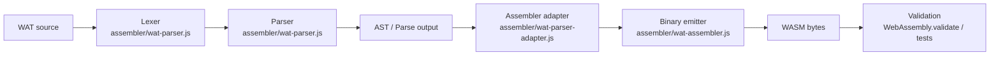
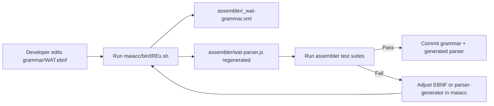
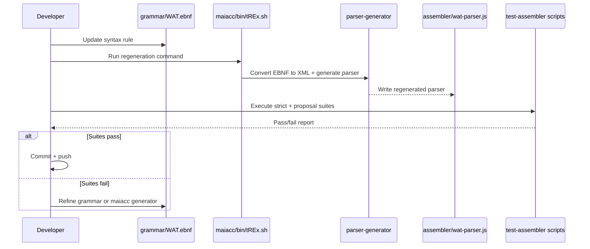

# MaiaWASM Architecture

This document describes the current architecture of MaiaWASM, focusing on:

- the WAT-to-WASM assembly flow
- the grammar-to-parser generation flow
- the recommended change lifecycle for grammar/parser updates

## 1. High-Level Assembly Pipeline



### Notes

- The parser is generated code and should be treated as an artifact.
- Main behavior changes for syntax should start from grammar and generator sources.
- Validation happens through automated suites and runtime module validation.

## 2. Grammar-to-Parser Generation Flow



### Canonical command

```bash
bash ./maiacc/bin/tREx.sh --ebnf --to-xml assembler/_wat-grammar.xml ./grammar/WAT.ebnf ./assembler/wat-parser.js
```

## 3. Change Lifecycle Sequence



## 4. Repository Components

- `assembler/`: assembler implementation, adapter, generated parser, and suites
- `grammar/`: EBNF grammar definitions
- `maiacc/`: parser-generator submodule used in regeneration
- `docs/`: architecture and process documentation

## 5. Design Principles

- Grammar-first changes: update grammar/generator first, not generated parser by hand.
- Generated artifacts are reproducible: parser output should be regenerated from source.
- Validation is mandatory: run strict and proposal suites before commit.
- Keep generated and source changes synchronized in commits.

## 6. Recommended Verification Checklist

1. Grammar/source changes are in place.
2. `assembler/wat-parser.js` was regenerated through `maiacc`.
3. Strict suite passes (`node assembler/test-assembler.js`).
4. Proposal suite passes (`node assembler/test-assembler-proposals.js`).
5. Commit includes both source-of-truth updates and regenerated artifacts.
